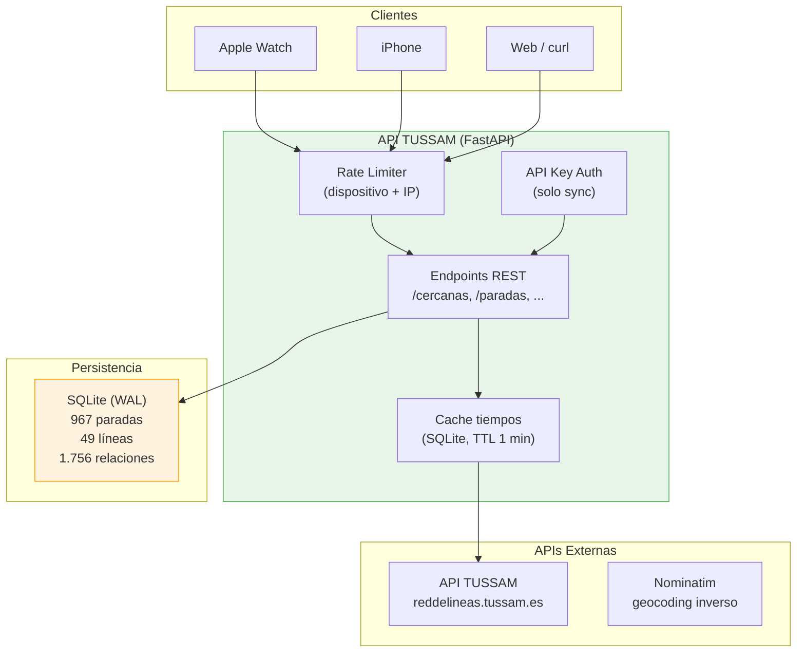
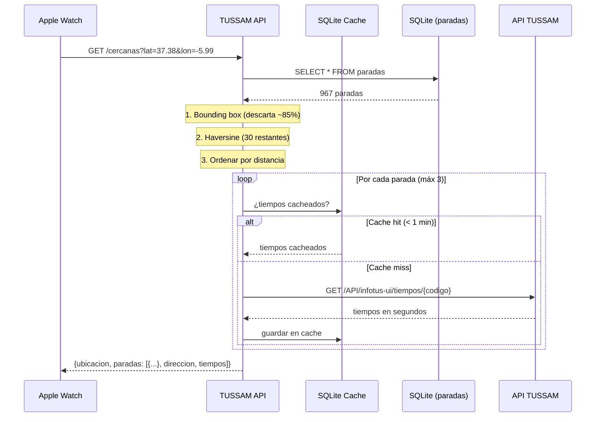
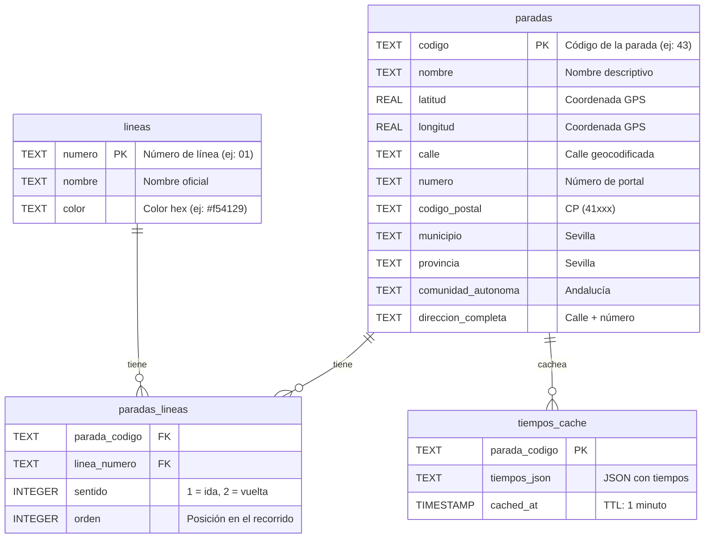

# TUSSAM API

API REST para obtener horarios y paradas de TUSSAM (Transportes Urbanos de Sevilla) en tiempo real. Diseñada para alimentar aplicaciones iOS, Watch y cualquier cliente HTTP.

[](LICENSE)
[](https://www.python.org/)
[](https://fastapi.tiangolo.com/)

---

## ¿Por qué esta API?

TUSSAM ofrece una API interna en `reddelineas.tussam.es` con las siguientes limitaciones:

- **Rate limit estricto**: bloquea peticiones frecuentes con HTTP 429.
- **Sin CORS abierto**: no permite llamadas desde navegadores ni apps.
- **Formato propietario**: coordenadas multiplicadas por 10⁶, fechas con formato específico.
- **Sin direcciones**: solo coordenadas GPS, sin calle ni número.

Esta API actúa como **proxy inteligente** que resuelve esos problemas:

- **Cacheo automático** de tiempos de llegada (TTL: 1 minuto).
- **Normalización** de coordenadas (÷ 10⁶ → grados decimales).
- **Geocodificación inversa** pregrabada: cada parada tiene calle y número.
- **Reintentos con backoff** para manejar los 429 de TUSSAM.
- **CORS abierto** para llamadas desde cualquier cliente.
- **Endpoint optimizado** para AppleWatch: una sola llamada da todo.

---

## Arquitectura



## Flujo de una petición



---

## Base de Datos

El repositorio incluye `data/tussam.db` con datos precargados (sincronizados el 16 de febrero de 2026). No necesitas ejecutar ningún sync para empezar.

### Esquema



### Tabla de datos

| Tabla | Registros | Descripción |
|-------|-----------|-------------|
| `paradas` | 967 | Paradas de autobús con dirección geocodificada |
| `lineas` | 49 | Líneas de TUSSAM con nombre y color |
| `paradas_lineas` | 1.756 | Relación N:M (qué líneas paran en cada parada) |
| `tiempos_cache` | efímero | Cache de tiempos de llegada (TTL: 1 min) |

### Cobertura de direcciones

| Campo | Paradas cubiertas | Porcentaje |
|-------|------------------|------------|
| `calle` | 967/967 | 100% |
| `numero` | 795/967 | 82,2% |
| `codigo_postal` | 967/967 | 100% |
| `municipio` | 967/967 | 100% |
| `direccion_completa` | 967/967 | 100% |

El 17,8% sin número son paradas en glorietas, puentes, avenidas sin portales o estaciones (ej: «Prado San Sebastián», «Aeropuerto de Sevilla»). Estas tienen `numero = "s/n"`.

---

## Instalación

### Desde GitHub Container Registry (más rápido)

```bash
docker pull ghcr.io/686f6c61/api-tussam:main
export SYNC_API_KEY=$(openssl rand -hex 32)
docker run -d -p 8081:8080 \
  -e SYNC_API_KEY="$SYNC_API_KEY" \
  -v $(pwd)/data:/app/data \
  ghcr.io/686f6c61/api-tussam:main
```

### Con Docker Compose (recomendado para desarrollo)

```bash
git clone https://github.com/686f6c61/API-TUSSAM.git
cd API-TUSSAM
export SYNC_API_KEY=$(openssl rand -hex 32)
docker compose up -d
```

La API estará en `http://localhost:8081`. La base de datos con 967 paradas viene incluida en el repositorio y se monta como volumen.

### Con Python (desarrollo)

```bash
git clone https://github.com/686f6c61/API-TUSSAM.git
cd API-TUSSAM
pip install -e .
export SYNC_API_KEY=$(openssl rand -hex 32)
uvicorn app.main:app --port 8080
```

---

## Uso

### Petición típica de AppleWatch

```bash
curl "http://localhost:8081/cercanas?lat=37.3891&lon=-5.9845&max_paradas=2"
```

### Respuesta

```json
{
  "ubicacion": {"lat": 37.3891, "lon": -5.9845, "bearing": null},
  "paradas": [
    {
      "codigo": "43",
      "nombre": "Recaredo (Puerta Carmona)",
      "latitud": 37.389663,
      "longitud": -5.984265,
      "distancia": 66,
      "calle": "Calle Recaredo",
      "numero": "6-7",
      "codigo_postal": "41003",
      "municipio": "Sevilla",
      "direccion": "Calle Recaredo 6-7",
      "tiempos": [
        {
          "linea": "C4",
          "color": "#008431",
          "tiempo_minutos": 4,
          "destino": "PLAZA DE ARMAS",
          "distancia_metros": 783
        }
      ]
    }
  ]
}
```

### Todos los endpoints

| Método | Ruta | Auth | Descripción |
|--------|------|------|-------------|
| GET | `/` | No | Información de la API |
| GET | `/health` | No | Health check (verifica DB) |
| GET | `/cercanas` | No | **Principal**: paradas cercanas + tiempos |
| GET | `/paradas` | No | Todas las paradas |
| GET | `/paradas/cercanas` | No | Paradas cercanas (solo coordenadas) |
| GET | `/paradas/{codigo}` | No | Una parada específica |
| GET | `/paradas/{codigo}/tiempos` | No | Tiempos de una parada |
| GET | `/lineas` | No | Todas las líneas |
| POST | `/sync/paradas` | API Key | Sincronizar paradas |
| POST | `/sync/lineas` | API Key | Sincronizar líneas |
| POST | `/sync/all` | API Key | Sincronización completa |

Para documentación interactiva en desarrollo: `http://localhost:8081/docs` (Swagger UI) o `/redoc`. En producción se puede desactivar con `ENABLE_DOCS=false`.

---

## Parámetros del endpoint principal

`GET /cercanas` acepta los siguientes parámetros para filtrar y ordenar resultados:

| Parámetro | Tipo | Default | Descripción |
|-----------|------|---------|-------------|
| `lat` | float | obligatorio | Latitud del usuario |
| `lon` | float | obligatorio | Longitud del usuario |
| `radio` | int | 300 | Radio de búsqueda en metros |
| `max_paradas` | int | 3 | Máximo de paradas a devolver |
| `bearing` | float | null | Orientación del usuario (0-360°) |
| `bearing_tolerance` | float | 60 | Tolerancia para el filtro de orientación |
| `tiempo_max` | int | null | Solo buses que lleguen en ≤ X minutos |
| `lineas` | string | null | Filtrar líneas: "01,C4,21" |
| `incluir_mapa` | bool | false | Añadir URL de OpenStreetMap |
| `formato` | string | "json" | "json" o "geojson" |

### Filtrar por orientación (bearing)

Cuando hay dos paradas en sentidos opuestos (una por cada acera), puedes filtrar por la orientación del usuario:

```
GET /cercanas?lat=37.3891&lon=-5.9845&bearing=180&bearing_tolerance=45
```

Esto devuelve solo las paradas cuya orientación desde el usuario difiere en 45° o menos de 180° (sur). Las paradas en sentido opuesto (bearing ~0°) se descartan. El AppleWatch proporciona el bearing mediante su brújula.

---

## Sincronización y Geocodificación

### Sincronización inicial

La base de datos incluida ya tiene 967 paradas, 49 líneas y sus relaciones. Si necesitas refrescar los datos:

```bash
# Sincronizar paradas y líneas desde la API de TUSSAM
curl -X POST http://localhost:8081/sync/all -H "X-API-Key: $SYNC_API_KEY"
```

### Geocodificación de direcciones

Cuando se añaden paradas nuevas (por cambios en las líneas), sus campos `calle` y `numero` estarán vacíos. Para rellenarlos:

```bash
python scripts/geocode_paradas.py
```

El script lee las coordenadas de la tabla `paradas`, consulta Nominatim (OpenStreetMap) y escribe los resultados. Respeta el rate limit de 1 petición por segundo.

La API **no** hace geocodificación en caliente durante las peticiones. Las direcciones se pregrabaron una vez y se almacenan directamente en la tabla `paradas`. Esto garantiza respuestas instantáneas.

### Scheduler semanal

El scheduler integrado ejecuta la sincronización cada domingo a las 04:00 UTC. Configurable por variables de entorno:

```bash
# En docker-compose.yml
SYNC_ENABLED=true   # Activar/desactivar
SYNC_DAY=sun        # Día de la semana
SYNC_HOUR=4         # Hora UTC
SYNC_MINUTE=0       # Minuto
```

---

## Rate Limiting

La API implementa dos niveles de rate limiting para protegerse y proteger a TUSSAM:

| Nivel | Límite | Cabecera | Propósito |
|-------|--------|----------|-----------|
| Dispositivo | 60 req/min | `X-Device-ID` | Limitar por AppleWatch/iPhone |
| IP (fallback) | 300 req/min | Dirección IP | Protección anti-DDoS |

Las cabeceras `X-RateLimit-Remaining`, `X-RateLimit-Limit` y `X-RateLimit-Reset` se incluyen en cada respuesta. Cuando se alcanza el límite, la API responde `429 Too Many Requests` con `Retry-After`. Este limitador es local al proceso; para despliegues con varios workers o réplicas conviene aplicar límites también en el proxy, CDN o balanceador.

---

## Seguridad

- **Endpoints públicos** (`GET`): sin autenticación, protegidos solo por rate limiting.
- **Endpoints de sync** (`POST /sync/*`): requieren API Key mediante cabecera `X-API-Key`.
- **CORS**: restringido a métodos `GET` y `POST`; los orígenes se configuran con `CORS_ORIGINS`.
- **Docs**: activas por defecto en desarrollo, configurables con `ENABLE_DOCS`.
- **Hosts**: se pueden limitar con `ALLOWED_HOSTS` cuando hay dominios de despliegue conocidos.
- **API Key**: `SYNC_API_KEY` no tiene valor por defecto. Define una clave aleatoria antes de arrancar.

```bash
# Ejemplo con API Key
curl -X POST http://localhost:8081/sync/all -H "X-API-Key: mi-clave-segura"
```

---

## Variables de Entorno

| Variable | Default | Descripción |
|----------|---------|-------------|
| `APP_ENV` | `development` | Entorno de ejecución (`production` aplica defaults más restrictivos) |
| `SYNC_API_KEY` | *(requerida)* | Clave para endpoints de sync |
| `ALLOW_UNAUTHENTICATED_SYNC` | `false` | Permite sync sin API key solo para desarrollo local explícito |
| `ENABLE_DOCS` | `true` en dev, `false` en prod | Habilitar `/docs`, `/redoc` y `/openapi.json` |
| `CORS_ORIGINS` | `*` en dev, vacío en prod | Orígenes CORS separados por coma |
| `ALLOWED_HOSTS` | vacío | Hosts permitidos separados por coma |
| `SYNC_ENABLED` | `true` | Activar scheduler semanal |
| `SYNC_DAY` | `sun` | Día de la semana para sync |
| `SYNC_HOUR` | `4` | Hora UTC para sync |
| `SYNC_MINUTE` | `0` | Minuto para sync |

---

## Estructura del Proyecto

```
TUSSAM/
├── app/
│   ├── __init__.py          # Paquete principal
│   ├── main.py              # Endpoints FastAPI, rate limiting, auth
│   ├── database.py          # SQLite: esquema, queries, conexión persistente
│   ├── scheduler.py          # Scheduler semanal con APScheduler
│   └── services/
│       └── tussam.py        # Cliente HTTP para API TUSSAM y Nominatim
├── scripts/
│   └── geocode_paradas.py   # Script standalone de geocodificación
├── docs/
│   ├── API.md               # Documentación completa de la API
│   └── docker.md            # Guía de despliegue con Docker
├── tests/
│   ├── conftest.py           # Fixtures compartidos
│   ├── test_database.py      # 23 tests de base de datos
│   ├── test_main.py          # 36 tests de endpoints
│   ├── test_tussam_service.py # 19 tests del servicio
│   ├── test_scheduler.py     # 8 tests del scheduler
│   └── test_e2e.py           # 30 tests end-to-end
├── landing/                  # Landing page de la app
├── data/                     # Base de datos SQLite (incluida en repo)
├── docker-compose.yml
├── Dockerfile
├── pyproject.toml
├── LICENSE
├── CHANGELOG.md
└── README.md
```

---

## Tecnologías

| Componente | Tecnología | Justificación |
|------------|-----------|---------------|
| Framework web | FastAPI 0.109+ | Async nativo, validación automática, OpenAPI, alto rendimiento |
| Base de datos | SQLite + aiosqlite | Sin servidor, un solo archivo, perfecto para ~1000 registros |
| Cliente HTTP | httpx 0.26+ | Async, soporte HTTP/2, timeouts configurables |
| Servidor | Uvicorn | Servidor ASGI de alto rendimiento |
| Scheduler | APScheduler 3.10+ | Programación de tareas async |
| Contenedor | Docker + Python 3.11-slim | Imagen ligera (~150 MB), fácil despliegue |
| Tests | pytest + pytest-asyncio | Testing async, fixtures, cobertura |

---

## Tests

```bash
# Ejecutar todos los tests (excepto E2E que requieren API real)
pytest tests/ --ignore=tests/test_e2e.py --ignore=tests/test_scheduler.py

# Con cobertura
pytest tests/ --ignore=tests/test_e2e.py --ignore=tests/test_scheduler.py --cov=app
```

78 tests cubren:
- **Base de datos**: esquema, CRUD, cache, migraciones, transacciones
- **Endpoints**: todas las rutas, códigos HTTP, validación de parámetros, GeoJSON
- **Servicio TUSSAM**: paradas cercanas, bearing, rate limiting, sync
- **Scheduler**: jobs, variables de entorno, manejo de errores

---

## Licencia

MIT — ver [LICENSE](LICENSE).
