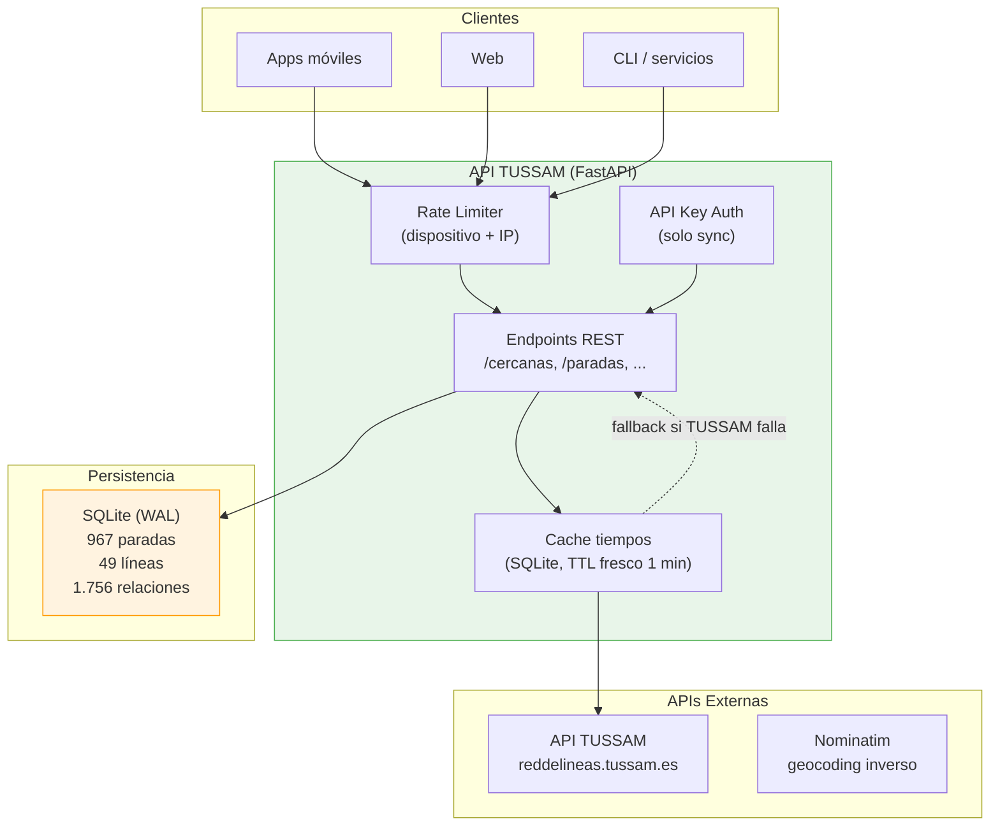
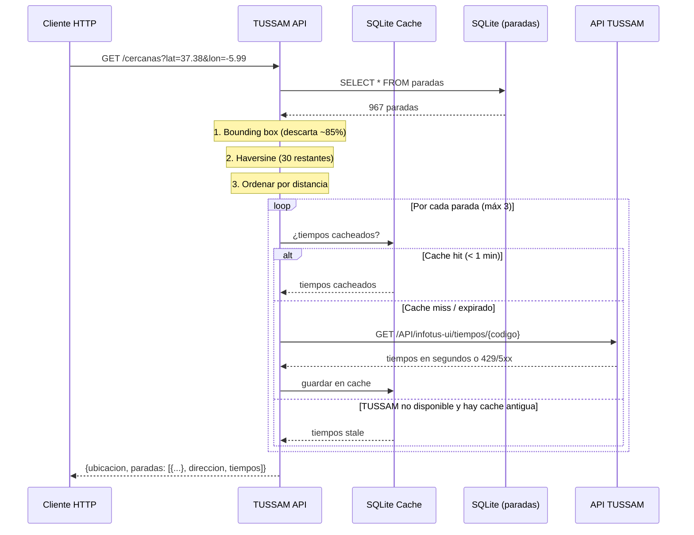
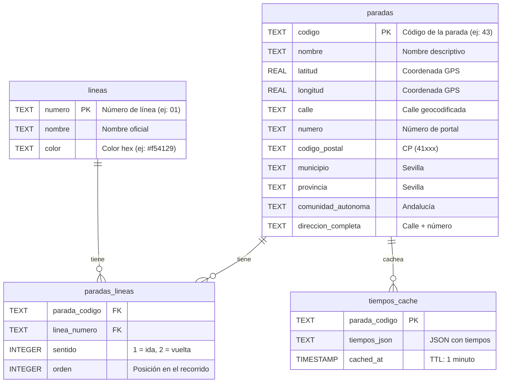

# TUSSAM API

API REST para obtener horarios y paradas de TUSSAM (Transportes Urbanos de Sevilla) en tiempo real. Diseñada para alimentar apps, webs, integraciones y cualquier cliente HTTP.

[](LICENSE)
[](https://www.python.org/)
[](https://fastapi.tiangolo.com/)

---

## ¿Por qué esta API?

TUSSAM ofrece una API interna en `reddelineas.tussam.es` con las siguientes limitaciones:

- **Rate limit estricto**: bloquea peticiones frecuentes con HTTP 429.
- **Sin CORS abierto**: no permite llamadas desde navegadores ni apps.
- **Formato propietario**: coordenadas multiplicadas por 10⁶, fechas con formato específico.
- **Sin direcciones**: solo coordenadas GPS, sin calle ni número.

Esta API actúa como **proxy inteligente** que resuelve esos problemas:

- **Cacheo automático** de tiempos de llegada (TTL: 1 minuto).
- **Single-flight por parada**: peticiones simultáneas comparten una sola llamada a TUSSAM.
- **Fallback con cache antigua** si TUSSAM falla temporalmente.
- **Normalización** de coordenadas (÷ 10⁶ → grados decimales).
- **Geocodificación inversa** pregrabada: cada parada tiene calle y número.
- **Reintentos con backoff y `Retry-After`** para manejar los 429 de TUSSAM.
- **CORS abierto** para llamadas desde cualquier cliente.
- **Endpoint agregado**: una sola llamada devuelve paradas cercanas y tiempos.

---

## Arquitectura



## Flujo de una petición



---

## Base de Datos

El repositorio incluye `data/tussam.db` con datos precargados (sincronizados el 16 de febrero de 2026). No necesitas ejecutar ningún sync para empezar.

### Esquema



### Tabla de datos

| Tabla | Registros | Descripción |
|-------|-----------|-------------|
| `paradas` | 967 | Paradas de autobús con dirección geocodificada |
| `lineas` | 49 | Líneas de TUSSAM con nombre y color |
| `paradas_lineas` | 1.756 | Relación N:M (qué líneas paran en cada parada) |
| `tiempos_cache` | efímero | Cache de tiempos de llegada (TTL: 1 min) |

### Cobertura de direcciones

| Campo | Paradas cubiertas | Porcentaje |
|-------|------------------|------------|
| `calle` | 967/967 | 100% |
| `numero` | 795/967 | 82,2% |
| `codigo_postal` | 967/967 | 100% |
| `municipio` | 967/967 | 100% |
| `direccion_completa` | 967/967 | 100% |

El 17,8% sin número son paradas en glorietas, puentes, avenidas sin portales o estaciones (ej: «Prado San Sebastián», «Aeropuerto de Sevilla»). Estas tienen `numero = "s/n"`.

---

## Instalación

### Desde GitHub Container Registry (más rápido)

```bash
docker pull ghcr.io/686f6c61/api-tussam:main
export SYNC_API_KEY=$(openssl rand -hex 32)
docker run -d -p 8081:8080 \
  -e SYNC_API_KEY="$SYNC_API_KEY" \
  -v $(pwd)/data:/app/data \
  ghcr.io/686f6c61/api-tussam:main
```

### Con Docker Compose (recomendado para desarrollo)

```bash
git clone https://github.com/686f6c61/API-TUSSAM.git
cd API-TUSSAM
export SYNC_API_KEY=$(openssl rand -hex 32)
docker compose up -d
```

La API estará en `http://localhost:8081`. La base de datos con 967 paradas viene incluida en el repositorio y se monta como volumen.

### Con Python (desarrollo)

```bash
git clone https://github.com/686f6c61/API-TUSSAM.git
cd API-TUSSAM
pip install -e .
export SYNC_API_KEY=$(openssl rand -hex 32)
uvicorn app.main:app --port 8080
```

---

## Uso

### Petición típica

```bash
curl "http://localhost:8081/cercanas?lat=37.3891&lon=-5.9845&max_paradas=2"
```

### Respuesta

```json
{
  "ubicacion": {"lat": 37.3891, "lon": -5.9845, "bearing": null},
  "paradas": [
    {
      "codigo": "43",
      "nombre": "Recaredo (Puerta Carmona)",
      "latitud": 37.389663,
      "longitud": -5.984265,
      "distancia": 66,
      "calle": "Calle Recaredo",
      "numero": "6-7",
      "codigo_postal": "41003",
      "municipio": "Sevilla",
      "direccion_completa": "Calle Recaredo 6-7",
      "tiempos_status": "ok",
      "tiempos": [
        {
          "linea": "C4",
          "color": "#008431",
          "tiempo_minutos": 4,
          "destino": "PLAZA DE ARMAS",
          "distancia_metros": 783
        }
      ]
    }
  ]
}
```

### Todos los endpoints

| Método | Ruta | Auth | Descripción |
|--------|------|------|-------------|
| GET | `/` | No | Información de la API |
| GET | `/health` | No | Health check (verifica DB) |
| GET | `/cercanas` | No | **Principal**: paradas cercanas + tiempos |
| GET | `/paradas` | No | Todas las paradas |
| GET | `/paradas/cercanas` | No | Paradas cercanas (solo coordenadas) |
| GET | `/paradas/{codigo}` | No | Una parada específica |
| GET | `/paradas/{codigo}/tiempos` | No | Tiempos de una parada |
| GET | `/lineas` | No | Todas las líneas |
| POST | `/sync/paradas` | API Key | Sincronizar paradas |
| POST | `/sync/lineas` | API Key | Sincronizar líneas |
| POST | `/sync/all` | API Key | Sincronización completa |

Para clientes móviles, webs o integraciones, el flujo recomendado es usar `/cercanas` cuando se parte de coordenadas. Si el cliente ya conoce el código de una parada, `/paradas/{codigo}/tiempos` mantiene un contrato estable: cuando TUSSAM no responde, devuelve `200` con `tiempos: []` y `upstream_status: "unavailable"` en lugar de propagar un `503`.

Para documentación interactiva en desarrollo: `http://localhost:8081/docs` (Swagger UI) o `/redoc`. En producción se puede desactivar con `ENABLE_DOCS=false`.

---

## Parámetros del endpoint principal

`GET /cercanas` acepta los siguientes parámetros para filtrar y ordenar resultados:

| Parámetro | Tipo | Default | Descripción |
|-----------|------|---------|-------------|
| `lat` | float | obligatorio | Latitud del usuario |
| `lon` | float | obligatorio | Longitud del usuario |
| `radio` | int | 300 | Radio de búsqueda en metros |
| `max_paradas` | int | 3 | Máximo de paradas a devolver |
| `bearing` | float | null | Orientación del usuario (0-360°) |
| `bearing_tolerance` | float | 60 | Tolerancia para el filtro de orientación |
| `tiempo_max` | int | null | Solo buses que lleguen en ≤ X minutos |
| `lineas` | string | null | Filtrar líneas: "01,C4,21" |
| `incluir_mapa` | bool | false | Añadir URL de OpenStreetMap |
| `formato` | string | "json" | "json" o "geojson" |

### Filtrar por orientación (bearing)

Cuando hay dos paradas en sentidos opuestos (una por cada acera), puedes filtrar por la orientación del usuario:

```
GET /cercanas?lat=37.3891&lon=-5.9845&bearing=180&bearing_tolerance=45
```

Esto devuelve solo las paradas cuya orientación desde el usuario difiere en 45° o menos de 180° (sur). Las paradas en sentido opuesto (bearing ~0°) se descartan. El `bearing` puede venir de cualquier cliente con brújula, sensores de orientación o lógica propia.

---

## Sincronización y Geocodificación

### Sincronización inicial

La base de datos incluida ya tiene 967 paradas, 49 líneas y sus relaciones. Si necesitas refrescar los datos:

```bash
# Sincronizar paradas y líneas desde la API de TUSSAM
curl -X POST http://localhost:8081/sync/all -H "X-API-Key: $SYNC_API_KEY"
```

### Geocodificación de direcciones

Cuando se añaden paradas nuevas (por cambios en las líneas), sus campos `calle` y `numero` pueden estar vacíos. Se rellenan desde el endpoint protegido de sincronización:

```bash
curl -X POST http://localhost:8081/sync/direcciones -H "X-API-Key: $SYNC_API_KEY"
```

La API consulta Nominatim (OpenStreetMap), respeta su rate limit de 1 petición por segundo y guarda los resultados directamente en SQLite.

La API **no** hace geocodificación en caliente durante las peticiones. Las direcciones se pregrabaron una vez y se almacenan directamente en la tabla `paradas`. Esto garantiza respuestas instantáneas.

### Scheduler semanal

El scheduler integrado ejecuta la sincronización cada domingo a las 04:00 UTC. Configurable por variables de entorno:

```bash
# En docker-compose.yml
SYNC_ENABLED=true   # Activar/desactivar
SYNC_DAY=sun        # Día de la semana
SYNC_HOUR=4         # Hora UTC
SYNC_MINUTE=0       # Minuto
```

---

## Rate Limiting

La API aplica dos cubos de rate limiting **de forma conjunta**, no como alternativa. Cada petición se contabiliza en el cubo de su IP y, si trae un `X-Device-ID` válido, también en el de ese dispositivo. Se responde `429` si **cualquiera** de los dos supera su límite, de modo que el identificador de dispositivo (que elige el cliente) nunca sirve para saltarse el techo por IP:

| Nivel | Límite | Cabecera | Propósito |
|-------|--------|----------|-----------|
| IP | 300 req/min | Dirección IP real | Techo anti-DDoS, siempre aplicado |
| Dispositivo | 60 req/min | `X-Device-ID` | Sublímite más estricto por cliente |

Las cabeceras `X-RateLimit-Remaining`, `X-RateLimit-Limit` y `X-RateLimit-Reset` se incluyen en cada respuesta (reportan el cubo más restrictivo). Cuando se alcanza el límite, la API responde `429 Too Many Requests` con `Retry-After`. El endpoint `/health` está exento.

**Detrás de un proxy:** el contenedor arranca uvicorn con `--proxy-headers`, y la variable `TRUSTED_PROXY_IPS` controla desde qué IPs se acepta `X-Forwarded-For` para derivar la IP real del cliente. Sin configurarla, se limita por la IP de conexión directa. Este limitador es local al proceso: despliega con un solo worker y escala por réplicas; para un límite global real, externaliza el estado (Redis) o aplica límites también en el proxy o CDN.

---

## Seguridad

- **Endpoints públicos** (`GET`): sin autenticación, protegidos por rate limiting y validación de formato de parámetros en el borde (los códigos de parada deben ser numéricos; los de línea, alfanuméricos).
- **Endpoints de sync** (`POST /sync/*`): requieren API Key mediante cabecera `X-API-Key`, comparada con `hmac.compare_digest` para evitar *timing attacks*. Solo se ejecuta una sincronización a la vez (`409` si hay otra en curso).
- **Cabeceras de seguridad HTTP**: `X-Content-Type-Options: nosniff`, `X-Frame-Options: DENY`, `Referrer-Policy: no-referrer` en todas las respuestas, y `Strict-Transport-Security` en producción.
- **Cliente saliente**: `follow_redirects` desactivado hacia el origen para evitar SSRF por redirecciones no previstas.
- **CORS**: restringido a métodos `GET` y `POST`; los orígenes se configuran con `CORS_ORIGINS` (vacío por defecto en producción).
- **Docs**: activas por defecto en desarrollo, desactivadas en producción; configurables con `ENABLE_DOCS`.
- **Hosts**: se pueden limitar con `ALLOWED_HOSTS` (localhost se añade siempre para no romper el health check).
- **API Key**: `SYNC_API_KEY` no tiene valor por defecto. El servicio rechaza operar (`503`) si falta o conserva el valor de ejemplo. `ALLOW_UNAUTHENTICATED_SYNC` se bloquea en producción.

```bash
# Ejemplo con API Key (define la clave en tu entorno, nunca en el repositorio)
curl -X POST http://localhost:8081/sync/all -H "X-API-Key: $SYNC_API_KEY"
```

---

## Variables de Entorno

| Variable | Default | Descripción |
|----------|---------|-------------|
| `APP_ENV` | `development` | Entorno de ejecución (`production` aplica defaults más restrictivos) |
| `SYNC_API_KEY` | *(requerida)* | Clave para endpoints de sync |
| `ALLOW_UNAUTHENTICATED_SYNC` | `false` | Permite sync sin API key solo para desarrollo local explícito |
| `ENABLE_DOCS` | `true` en dev, `false` en prod | Habilitar `/docs`, `/redoc` y `/openapi.json` |
| `CORS_ORIGINS` | `*` en dev, vacío en prod | Orígenes CORS separados por coma |
| `ALLOWED_HOSTS` | vacío | Hosts permitidos separados por coma (localhost se añade siempre) |
| `TRUSTED_PROXY_IPS` | vacío | IPs de proxy de las que se acepta `X-Forwarded-For` para el rate limiting |
| `FORWARDED_ALLOW_IPS` | `127.0.0.1` | IPs de las que uvicorn confía en las cabeceras `X-Forwarded-*` |
| `TIEMPOS_CACHE_TTL_SECONDS` | `60` | TTL de cache fresca para tiempos de llegada |
| `TIEMPOS_STALE_TTL_SECONDS` | `600` | Tiempo máximo para devolver cache antigua si TUSSAM falla |
| `TUSSAM_MAX_CONCURRENT_REQUESTS` | `4` | Límite de concurrencia saliente hacia TUSSAM |
| `TUSSAM_SYNC_REQUEST_DELAY_SECONDS` | `0.2` | Pausa entre peticiones de sincronización a TUSSAM |
| `SYNC_MIN_COMPLETENESS_RATIO` | `0.8` | Proporción mínima del catálogo actual que un sync debe recuperar para reemplazarlo (protege frente a sincronizaciones en franjas de baja actividad) |
| `SYNC_ENABLED` | `true` | Activar scheduler semanal |
| `SYNC_DAY` | `sun` | Día de la semana para sync |
| `SYNC_HOUR` | `11` | Hora UTC para sync (mediodía, con la red en servicio) |
| `SYNC_MINUTE` | `0` | Minuto para sync |

---

## Estructura del Proyecto

```
TUSSAM/
├── app/
│   ├── __init__.py          # Paquete principal
│   ├── main.py              # Endpoints FastAPI, rate limiting, auth, cabeceras de seguridad
│   ├── database.py          # SQLite: esquema, queries, conexión persistente, lock de escritura
│   ├── env.py               # Lectura centralizada de variables de entorno
│   ├── scheduler.py          # Scheduler semanal con APScheduler
│   └── services/
│       └── tussam.py        # Cliente HTTP para API TUSSAM y Nominatim
├── docs/
│   ├── API.md               # Documentación completa de la API
│   └── docker.md            # Guía de despliegue con Docker
├── tests/
│   ├── conftest.py           # Fixtures compartidos
│   ├── test_database.py      # Tests de base de datos
│   ├── test_main.py          # Tests de endpoints
│   ├── test_tussam_service.py # Tests del servicio
│   ├── test_scheduler.py     # Tests del scheduler
│   └── test_e2e.py           # Tests end-to-end (requieren red)
├── data/                     # Base de datos SQLite (incluida en repo)
├── docker-compose.yml
├── Dockerfile
├── pyproject.toml
├── LICENSE
├── CHANGELOG.md
└── README.md
```

> La web (landing, documentación y mapa de paradas) no vive en esta rama: es un
> sitio estático que se sirve desde la rama [`landing`](https://github.com/686f6c61/API-TUSSAM/tree/landing)
> mediante GitHub Pages, en `https://tussam.686f6c61.dev/`.

---

## Tecnologías

| Componente | Tecnología | Justificación |
|------------|-----------|---------------|
| Framework web | FastAPI 0.109+ | Async nativo, validación automática, OpenAPI, alto rendimiento |
| Base de datos | SQLite + aiosqlite | Sin servidor, un solo archivo, perfecto para ~1000 registros |
| Cliente HTTP | httpx 0.26+ | Async, soporte HTTP/2, timeouts configurables |
| Servidor | Uvicorn | Servidor ASGI de alto rendimiento |
| Scheduler | APScheduler 3.10+ | Programación de tareas async |
| Contenedor | Docker + Python 3.11-slim | Imagen ligera (~150 MB), fácil despliegue |
| Tests | pytest + pytest-asyncio | Testing async, fixtures, cobertura |

---

## Tests

```bash
# Ejecutar todos los tests (excepto E2E que requieren API real)
pytest tests/ --ignore=tests/test_e2e.py --ignore=tests/test_scheduler.py

# Con cobertura
pytest tests/ --ignore=tests/test_e2e.py --ignore=tests/test_scheduler.py --cov=app
```

97 tests unitarios cubren:
- **Base de datos**: esquema, CRUD, cache (con TTL en UTC), migraciones, transacciones bajo lock de escritura
- **Endpoints**: todas las rutas, códigos HTTP, validación de formato de parámetros, GeoJSON
- **Servicio TUSSAM**: paradas cercanas, bearing, rate limiting combinado, sync con conteo de fallos
- **Scheduler**: jobs, variables de entorno, manejo de errores

Los tests de `test_e2e.py` golpean la API real de TUSSAM y solo pasan si el origen está accesible (no bloqueado por Cloudflare); no forman parte de la suite determinista.

---

## Web: landing, documentación y mapa

El sitio web es estático (HTML/CSS/JS, sin backend) y **vive en la rama [`landing`](https://github.com/686f6c61/API-TUSSAM/tree/landing)**, no en `main`. Se publica con GitHub Pages en `https://tussam.686f6c61.dev/` e incluye:

- **Landing** de presentación de la API.
- **Documentación** web navegable: autenticación, rate limiting, resiliencia, referencia completa de endpoints con ejemplos, códigos de error y variables de entorno.
- **Mapa de paradas** interactivo con búsqueda y filtros por línea y por zona.

Para trabajar en la web, sitúate en la rama `landing` y sírvela con cualquier servidor estático (`python3 -m http.server`).

---

## Licencia

**PolyForm Noncommercial License 1.0.0** — ver [LICENSE](LICENSE).

Puedes usar, modificar y distribuir este software **solo con fines no comerciales**: uso personal, investigación, educación y organizaciones sin ánimo de lucro. Para cualquier uso comercial, contacta con el autor. Es un proyecto independiente sin relación con TUSSAM.
